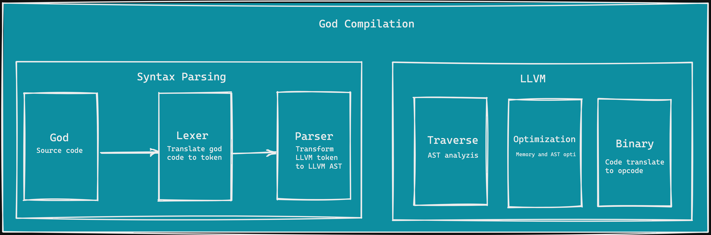

## God - Programming Language

I am student in Cybersecurity at 2600 school. 😏

Being passionate about how programming languages work, 

I started developing my own language. I called it God (don't ask me why).


Step compilation



✅  Lexer

❌ Parser

❌ AST

**...soon**


```god

# My first programming language
# The first programming language in golang By Lexter
fn main (params1: string, params2: string) @void {
  let name = 1337
  print(name)

  if(ok == 10) {
    name = 134
  }
}
```


Futures features:

Obfuscate the target blockstatement function by cff keyword

```god
[cff] -> fn sum(a: []int) @int {
  let sum = 0

  for n of a {
    sum = sum + n
  }
  
  return(sum)
}
```


## ❌ this project is in development
