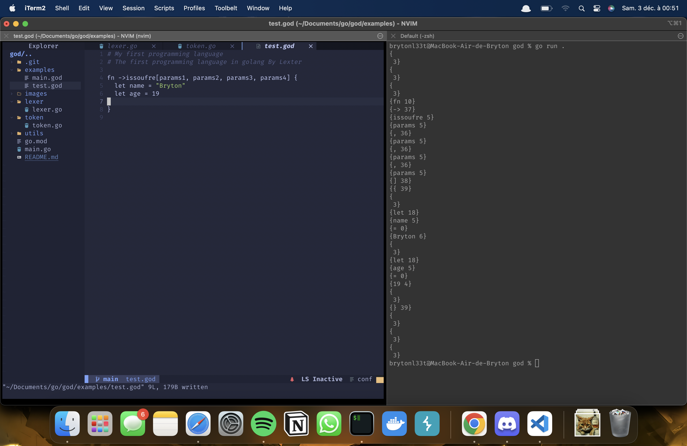

## God - Programming Language

I am student in Cybersecurity at 2600 school. 😏

Being passionate about how programming languages work, 

I started developing my own language. I called it God (don't ask me why).


Step compilation


✅  Lexer

❌ Parser

❌ AST

**...soon**


```god

fn -> hello(name) {
  print("Hello "+name)
}

fn -> main() {
  hello("Bryton")
}
```


Futures features:

Obfuscate the target blockstatement function by cff keyword

```god
cff fn -> obfuscate_func() {
  let name = "Bryton"

  if(name == "Bryton") {
    print("Bravo")
  } else {
    print("Nop")
  }
}
```




## ❌ this project is in development
